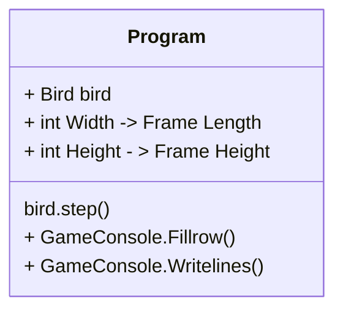
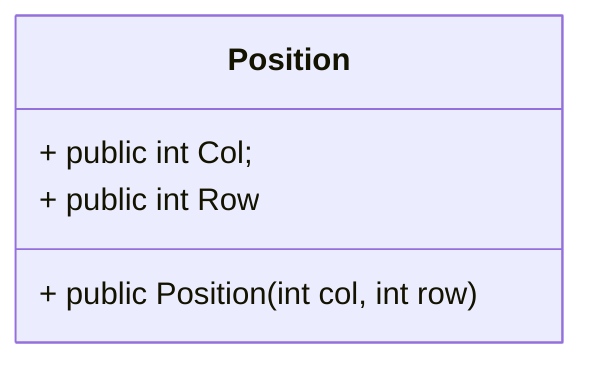
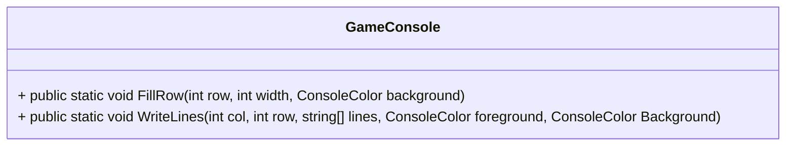
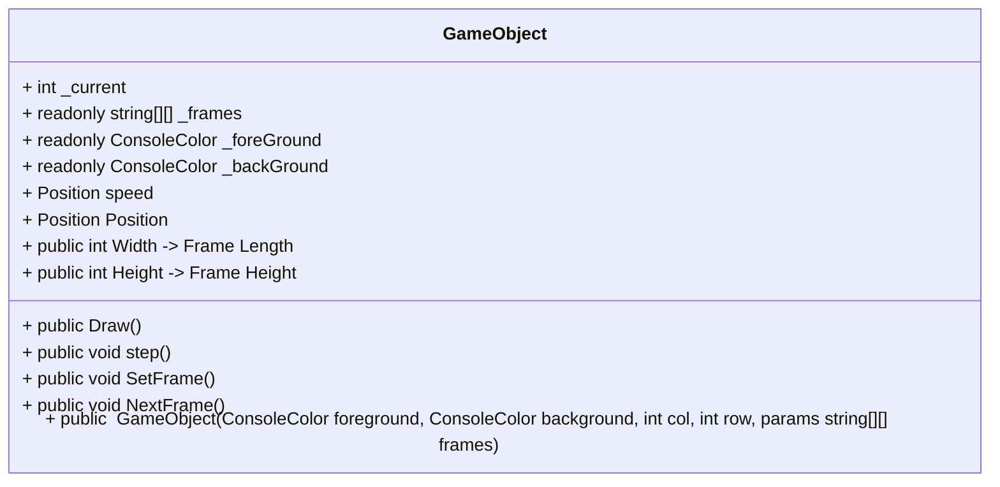
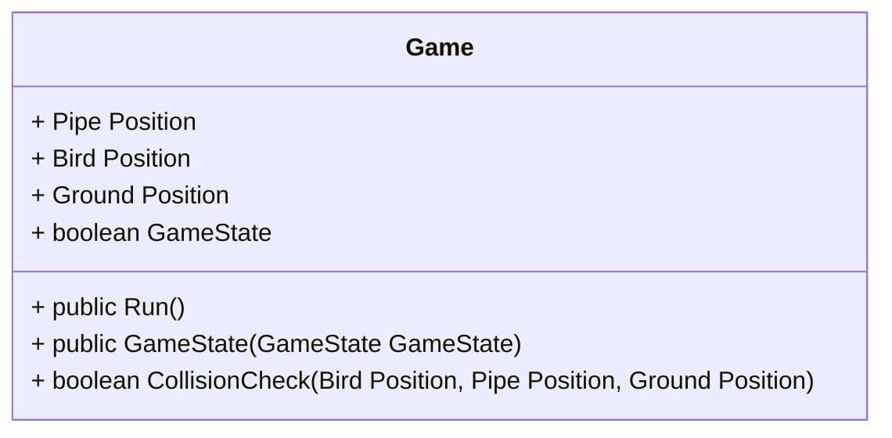
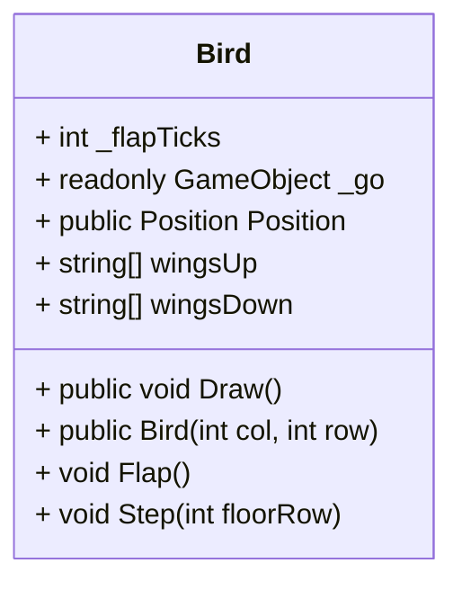
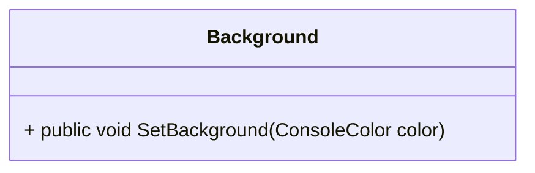
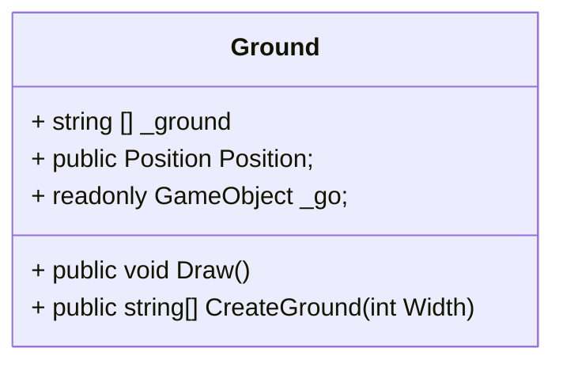
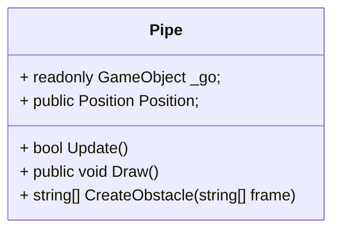

# Klasse diagram for OOP

##  Program klassen

##  'Position' klassen

##  'Game' Konsoll klassen

##  'GameObject' klassen

##  'Game' klassen

##  'Bird' klassen

##  'Background' klassen

##  'Ground' klassen

##  Pipe klassen

