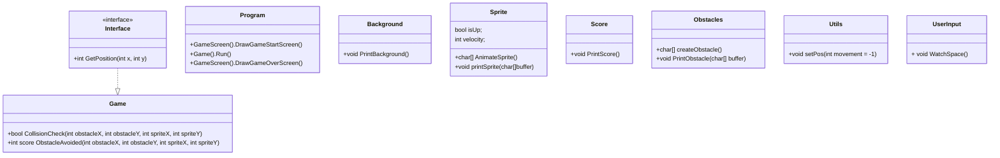

## Klasse diagram for OOP

```mermaid
    classDiagram

        Interface ..|> Game

        class Program {
            +GameScreen().DrawGameStartScreen()
            +Game().Run()
            +GameScreen().DrawGameOverScreen()
        }

        class Interface {
            +int GetPosition(int x, int y)
        }

        class Game {
            +bool CollisionCheck(int obstacleX, int obstacleY, int spriteX, int spriteY)
            +int score ObstacleAvoided(int obstacleX, int obstacleY, int spriteX, int spriteY)
        }
        <<interface>> Interface
        Game implements Interface

        class Background {
            +void PrintBackground()
        }

        class Sprite {
            bool isUp;
            int velocity;
            +char[] AnimateSprite()
            +void printSprite(char[]buffer)
        }

        class Score {
            +void PrintScore()
        }

        class Obstacles {
            +char[] createObstacle()
            +void PrintObstacle(char[] buffer)
        }

        class Utils {
            +void setPos(int movement = -1)
        }

        class UserInput {
            + void WatchSpace()
        }
```