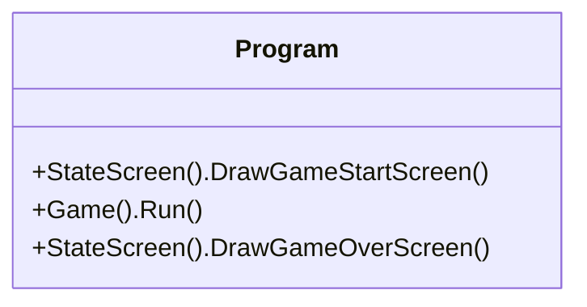
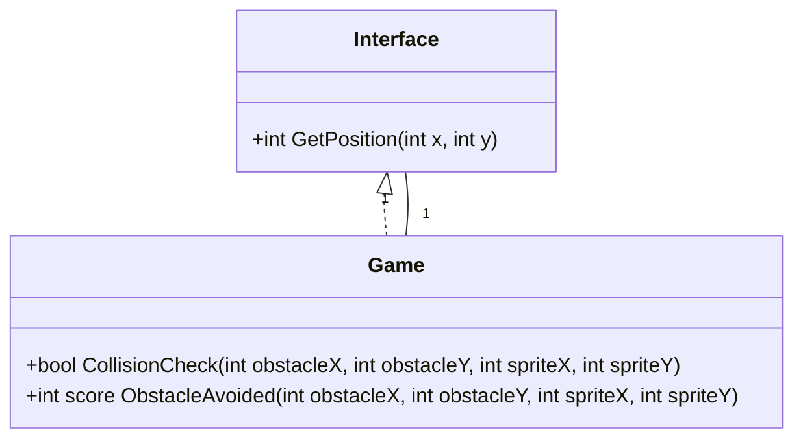
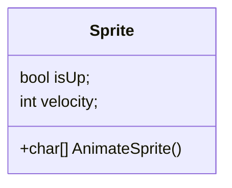
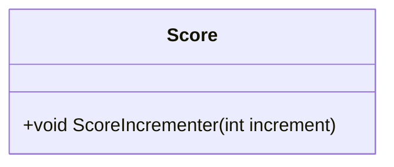
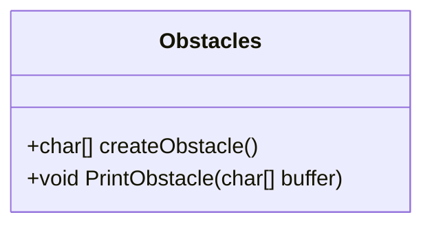
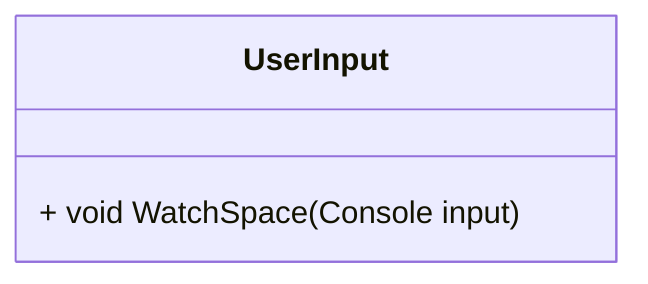
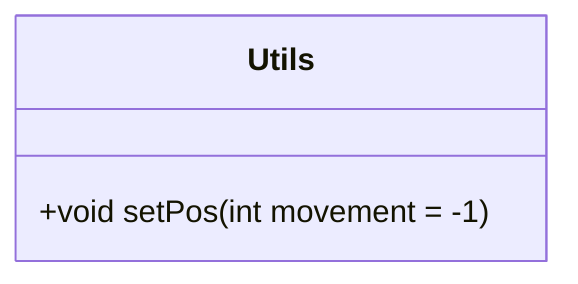
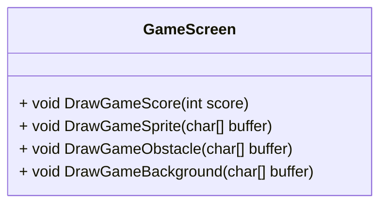
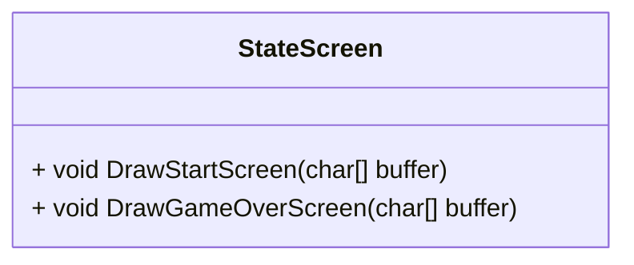

# Klasse diagram for OOP

##  Program

##  Game klassen og interface

##  Sprite klassen

##  Score klassen

##  Obstacles klassen

##  UserInput klassen

##  Utils klassen

##  Game Screen

##  StateScreen

