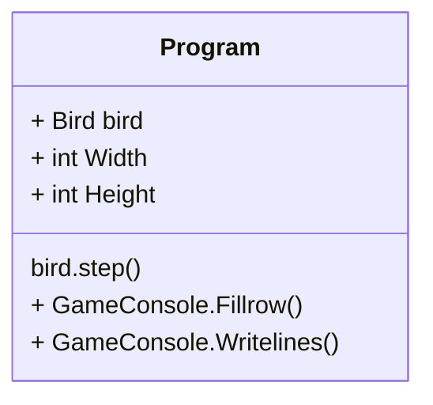
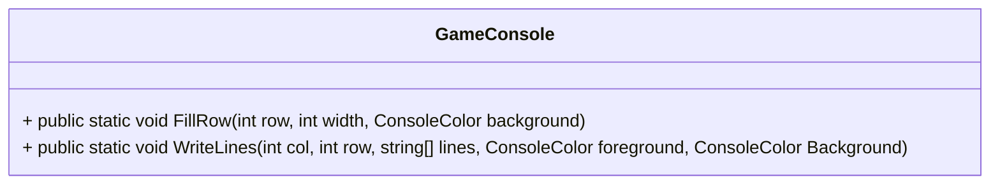
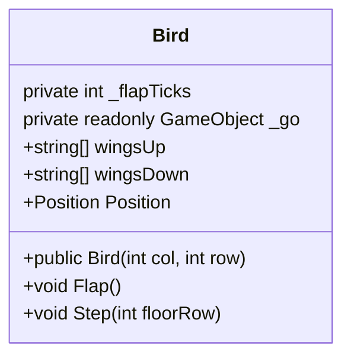
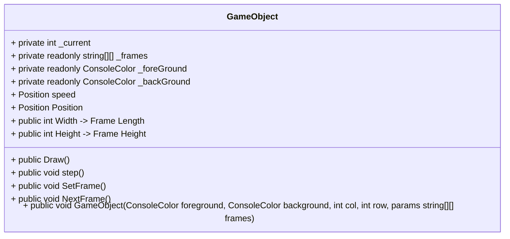
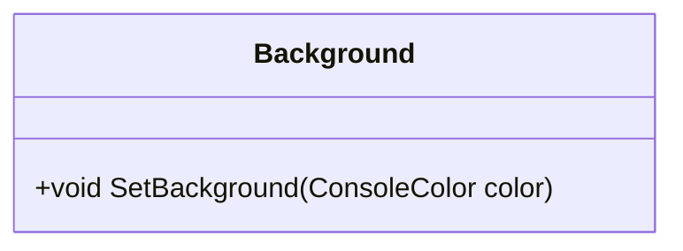
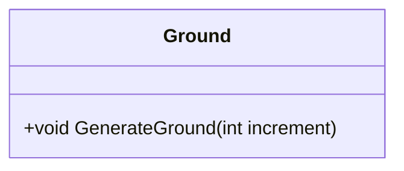
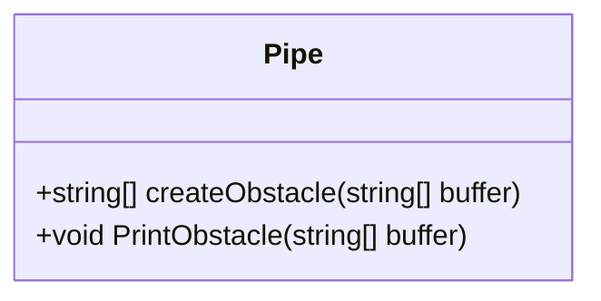

# Klasse diagram for OOP

##  Program

```mermaid
    classDiagram
        direction TD

        class Program {
            + Bird bird
            + int Width
            + int Height

            bird.step()
            + GameConsole.Fillrow()
            + GameConsole.Writelines()
    }
```

##  'Game' Konsollen

```mermaid
    classDiagram
        direction TD

    class GameConsole {
        + public static void FillRow(int row, int width, ConsoleColor background)
        + public static void WriteLines(int col, int row, string[] lines, ConsoleColor foreground, ConsoleColor Background)
    }
```

##  Tegningkarakter klassen

```mermaid
    classDiagram
        direction TD

    class Bird {
        private int _flapTicks
        private readonly GameObject _go

        +string[] wingsUp
        +string[] wingsDown

        +public Bird(int col, int row)

        +Position Position

        +void Flap()
        +void Step(int floorRow)
    }
```

##  Spill objektet

```mermaid
    classDiagram
        direction TD

        class GameObject {
            + private int _current
            + private readonly string[][] _frames
            + private readonly ConsoleColor _foreGround
            + private readonly ConsoleColor _backGround

            + Position speed
            + Position Position

            + public int Width -> Frame Length
            + public int Height -> Frame Height

            + public Draw()
            + public void step()
            + public void SetFrame()
            + public void NextFrame()
            + public void GameObject(ConsoleColor foreground, ConsoleColor background, int col, int row, params string[][] frames)
        }
```

##  'Background' klassen

```mermaid
    classDiagram
        direction TD

        class Background {
            +void SetBackground(ConsoleColor color)
        }
```

##  'Ground' klassen

```mermaid
    classDiagram
        direction TD

        class Ground {
            +void GenerateGround(int increment)
        }
```

##  'Pipe' klassen

```mermaid
    classDiagram
        direction TD

        class Pipe {
            +string[] createObstacle(string[] buffer)
            +void PrintObstacle(string[] buffer)
        }
```
