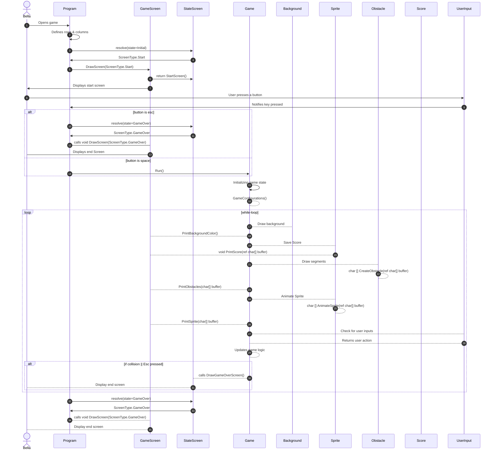

```mermaid
sequenceDiagram
    actor u as Bella
    participant p as Program
    participant gs as GameScreen
    participant sg as StateScreen
    participant g as Game
    participant b as Background
    participant s as Sprite
    participant o as Obstacle
    participant sc as Score
    participant UI as UserInput

    autonumber
    u ->> p: Opens game
    p ->> p: Defines rows & columns
    p ->> sg: resolve(state=Initial)
    sg ->> p: ScreenType.Start
    p ->> gs: DrawScreen(ScreenType.Start)
    gs ->> sg: return StartScreen()
    gs ->> u: Displays start screen

    u ->> UI: User presses a button
    UI->> p: Notifies key pressed
        alt button is esc
            p ->> sg: resolve(state=GameOver)
            sg->> p: ScreenType.GameOver
            p -> gs: calls void DrawScreen(ScreenType.GameOver)
            gs -> u: Displays end Screen
        else button is space
            p ->> g: Run()
        end

    g ->> g: Initializing game state

        g-->g: GameConfigurations()
    
        loop while-loop

            g-->b: Draw background
            g-->gs: PrintBackgroundColor()

            g-->s: Save Score
            s-->gs: void PrintScore(ref char[] buffer)
    
            g-->o: Draw segments
                o-->o: char [] CreateObstacle(ref char[] buffer) 
                %% At the beginning 5 rows and 5 columns
                %% during the game, use the score to increase difficulty?
                %% In Animation speed? columns?

            g-->gs: PrintObstacles(char[] buffer)

            g-->s: Animate Sprite
                s-->s: char [] AnimateSprite(ref char[] buffer)
            g-->gs: PrintSprite(char[] buffer)

            g-->UI: Check for user inputs
            UI-->g: Returns user action
            g-->g: Updates game logic

            alt if collision || Esc pressed
                g --> sg: calls DrawGameOverScreen()
                sg --> u: Display end screen
            end
        end

        p ->> sg: resolve(state=GameOver)
        sg->> p: ScreenType.GameOver
        p --> gs: calls void DrawScreen(ScreenType.GameOver)
        gs --> u: Display end screen
```