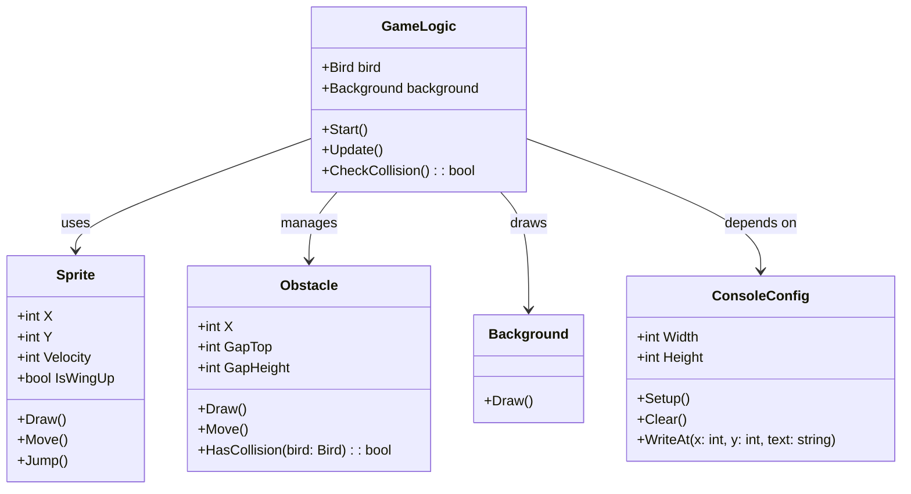

```mermaid
classDiagram

direction TB

    class Sprite {
	    +int X
	    +int Y
	    +int Velocity
	    +bool IsWingUp
	    +Draw()
	    +Move()
	    +Jump()
    }

    class Obstacle {
	    +int X
	    +int GapTop
	    +int GapHeight
	    +Draw()
	    +Move()
	    +HasCollision(bird: Bird) : bool
    }

    class Background {
	    +Draw()
    }

    class GameLogic {
	    +Bird bird
	    +Background background
	    +Start()
	    +Update()
	    +CheckCollision() : bool
    }

    class ConsoleConfig {
	    +int Width
	    +int Height
	    +Setup()
	    +Clear()
	    +WriteAt(x: int, y: int, text: string)
    }

    GameLogic --> Sprite : uses
    GameLogic --> Obstacle : manages
    GameLogic --> Background : draws
    GameLogic --> ConsoleConfig : depends on
```

